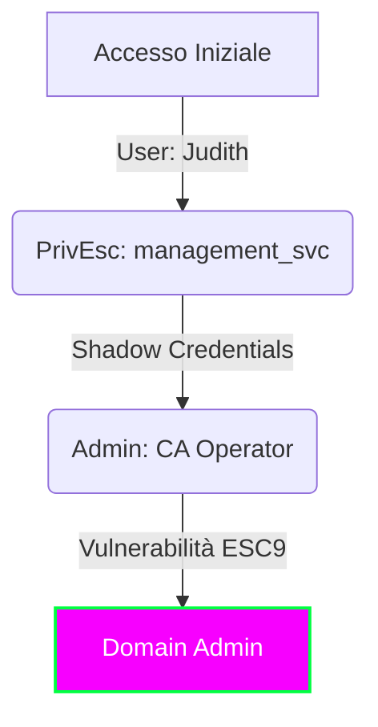

## 🎯 Executive Summary

**Certified** è una macchina Windows di difficoltà media progettata attorno a uno scenario di "assumed breach" (violazione presunta), dove vengono fornite le credenziali per un utente con privilegi limitati.<br> ( **judith.mader** : **judith09** )

| Attributo | Valore |
| :--- | :--- |
| **OS:** | Windows |
| **Difficulty:** | Medium |
| **MITRE TTPs:** |   |

> [!warning] Obiettivo
> **Accesso Iniziale (Foothold):** L'obiettivo iniziale è ottenere l'accesso all'account <u>management_svc</u>. Questo avviene enumerando le ACL (Access Control Lists) sugli oggetti privilegiati. L'enumerazione rivela che l'utente fornito, <u>judith.mader</u> possiede il permesso `WriteOwner` sul gruppo management. A sua volta, il gruppo management possiede il permesso `GenericWrite` sull'account <u>management_svc</u>, permettendo infine l'autenticazione al target tramite WinRM.<br>
> **Escalation dei Privilegi:** Per ottenere l'accesso all'account Administrator è necessario sfruttare l'Active Directory Certificate Service (ADCS). La tecnica specifica prevede l'abuso delle "`Shadow Credentials`" e lo sfruttamento della vulnerabilità `ESC9`. L'attacco ESC9 permette di modificare l'UPN (User Principal Name) di un utente (in questo caso <u>ca_operator</u>) in "Administrator", richiedere un certificato per quell'UPN e poi autenticarsi come Amministratore di Dominio.


---

## Reconnaissance
Scansione Nmap iniziale:
```bash
nmap -sC -sV -oA nmap/certified 10.10.11.12
```

---

## 🛡️ Remediation & Defense

L'intera catena di attacco su **Certified** si basa su una scarsa igiene delle ACL di Active Directory e su configurazioni insicure dei servizi di certificato (ADCS). Ecco le azioni correttive prioritarie.

> [!success] Fix Critico: Mitigazione ADCS (ESC9/UPN Spoofing)
> L'attacco finale sfrutta la possibilità di modificare il proprio `userPrincipalName` (UPN) per ingannare la CA e ottenere un certificato come Administrator.
>
> **Azione Correttiva:**
> 1.  **Abilitare Strong Certificate Binding:** Implementare la patch Microsoft **KB5014754**. Questa impone un mapping forte (Strong Mapping) tra il certificato e l'utente basato sul SID, rendendo inutile il trucco del cambio UPN.
> 2.  **Revisione Template:** Se il template non richiede la compatibilità con client legacy, rimuovere il flag `CT_FLAG_ENROLLEE_SUPPLIES_SUBJECT` se presente o restringere i permessi di enrollment solo agli amministratori.

> [!success] Hardening delle ACL & Monitoraggio
> Per prevenire il movimento laterale iniziale, è necessario intervenire a monte:
> 1.  **Principio del Privilegio Minimo (PoLP):**
  L'utente `judith.mader` non dovrebbe avere il permesso **WriteOwner** su un gruppo privilegiato come `Management`.
  Il gruppo `Management` non deve avere permessi **GenericWrite** o **GenericAll** sugli account di servizio (`management_svc`) o sugli operatori della CA (`ca_operator`).<br>
  <u>**Soluzione:** Eseguire audit periodici con strumenti come **PingCastle** o **BloodHound** per identificare e rimuovere relazioni di trust pericolose.</u><br>
> 2. **Rilevamento Shadow Credentials:**
  L'attacco ha utilizzato `pywhisker` per iniettare Key Credentials.
  **Detection:** <u>Monitorare le modifiche all'attributo `msDS-KeyCredentialLink` sugli oggetti utente e computer.</u><br>
  **Event ID:** <u>Configurare alert per l'Evento Windows **4742** (Computer Account Changed) o **4738** (User Account Changed) quando viene popolato questo attributo specifico.</u><br>
> 3. **Protezione Account Critici:**
  Account come `ca_operator` dovrebbero essere protetti tramite il gruppo **Protected Users** o marcati come "Account is sensitive and cannot be delegated" per limitare le superfici di attacco Kerberos.
